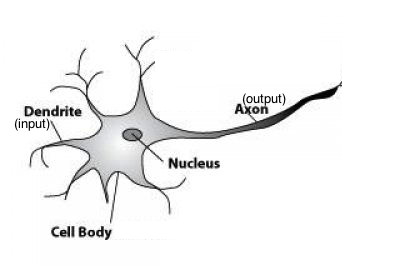

## Virtually Impossible Problems??

 
*Source: [xkcd](https://xkcd.com/1425/)*

လူတယောက်က ပုံတပုံကို ကြည့်လိုက်တာနဲ့ တန်းပြီး အဲပုံက ငှက်ပုံဟုတ်လား မဟုတ်ဘူးလားဆိုတာ ခွဲခြားလို့ရတယ်။ ကိုယ်တခါမှမမြင်ဖူးတဲ့ ငှက်အမျိုးအစားပုံတွေ့ရင်တောင် ဒါက ငှက်ပုံပဲဆိုတာကို လူ့ဦးနှောက်ကခွဲခြားပြီးသိတယ်။ ကွန်ပြူတာကိုတော့ အဲလိုမျိုးခွဲခြားတတ်ဖို့ ဘယ်လို program လုပ်မလဲ။ ဒီပြသနာက ဒီအတိုင်း explicitly program လုပ်လို့မရဘူး။ အဲဒါကြောင့် အပေါ်ကကာတွန်းမှာ “Virtually Impossible” လို့တင်စားပြောထားတယ်။

အဲဒါဆိုရင် ဒီပြသနာကို ဘယ်လိုဖြေရှင်းမလဲ။ အောက်ကပုံမှာလို Google Vision API ကိုငှက်ပုံပြရင် ငှက်ပါလို့ ၉၉% အသေအချာပြောနိုင်အောင်ဘယ်လိုလုပ်ထားလဲ။  
အဖြေက explicitly program လုပ်မဲ့အစား ကလေးတယောက်ကို သင်ပေးသလို၊ computer ကို ငှက်ပုံတွေအများကြီးပြပြီး ဒါကငှက်ပုံတွေဆိုပြီး နားလည်လာအောင်သင်ပေးထားတာပါ။ အဲတာကို Machine Learning လို့ခေါ်ပါတယ်။ အတိအကျပြောရရင် Artificial Neural Network လို့ခေါ်တဲ့နည်းပညာကို သုံးထားတာပါ။  

## Artificial Neural Network ဆိုတာဘာလဲ  

လူတွေရဲ့ဦးနှောက်က သန်းပေါင်းများစွာသော Neuron လေးတွေစုပေါင်းပြီး အလုပ်လုပ်တဲ့ Neural Network ဖြစ်တယ်။ Artificial Neural Network(ANN) ဆိုတာ လူရဲ့ ဦးနှောက်ထဲက Neural Network ကို မှီငြမ်းပြီးတော့ တည်ဆောက်ထားတာပါ။ သိထားရမဲ့တချက်က အပေါ်ယံပိုင်းကို မှီငြမ်းထားတာဖြစ်ပြီး အတွင်းပိုင်းက လူ့ဦးနှောက်နဲ့ အလုပ်လုပ်ပုံနဲ့ကွာပါတယ်။  ဦးနှောက်က အရမ်းဆန်းကြယ်ပြီး နားလည်ရခက်ပါတယ်။ ဦးနှောက်ရဲ့အလုပ်လုပ်ပုံကို တကယ်နားလည်အောင်လေ့လာပြီး သူနဲ့တူတဲ့ System တွေဆောက်တဲ့ဘာသာရပ်က Neuromorphic engineering လို့ခေါ်ပါတယ်။ ကဲပြောရင်းက တခြားဘက်တွေရောက်သွားပြီ။ :P ANN  ဘက်ပြန်ဆက်ရအောင်။

  
*Biological Neuron*

အပေါ်ယံပိုင်းတည်ဆောက်ပုံကိုကြည့်ရင် Neuron တွေမှာ တခြား Neuron တွေဆီကလာတဲ့ Signal တွေကို Dendrite လို့ခေါ်တဲ့ အစိတ်အပိုင်းလေးတွေကနေ လက်ခံရရှိတယ်။ ပြီးရင် Neuron ရဲ့ Computational Unit သဘောတရားနဲ့တူတဲ့ Cell Body ရှိတယ်။ ပြီးရင် သူ့ဆီက Signal တွေကို တခြား Neuron တွေဆီ လက်ဆင့်ကမ်းဖို့ Axon လို့ခေါ်တဲ့ အစိတ်အပိုင်းတွေရှိတယ်။

အဲဒီအပေါ်ယံ တည်ဆောက်ပုံကို အခြေခံပြီး Artificial Neuron တစ်ခုမှာ Input wires၊ Computational Unit နဲ့ Output wire တွေရှိတယ်။ အောက်ကပုံကတော့ Biological Neuron နဲ့ Artificial Neuron ကိုယှဉ်ပြထားတာပါ။  

  
*Source: [http://www.intechopen.com/source/html/39067/media/image1.png](http://www.intechopen.com/source/html/39067/media/image1.png)*  

ဒါကတော့ Neural Network ရဲ့အခြေခံ သဘောတရားပဲ။  

Neural Network ဘယ်လိုအလုပ်လုပ်သလဲ ဆိုတဲ့ technical ကျတဲ့အပိုင်းကိုတော့ အချိန်ရမှ ဆက်ရေးပေးပါမယ်။ :)

Credit:
Photos not owned by me. 

References:  
[Coursera Machine Learning](https://www.coursera.org/learn/machine-learning)  
[Everything You Need to Know About Artificial Neural Networks ](https://medium.com/technology-invention-and-more/everything-you-need-to-know-about-artificial-neural-networks-57fac18245a1#.ud8aw7z8p)

